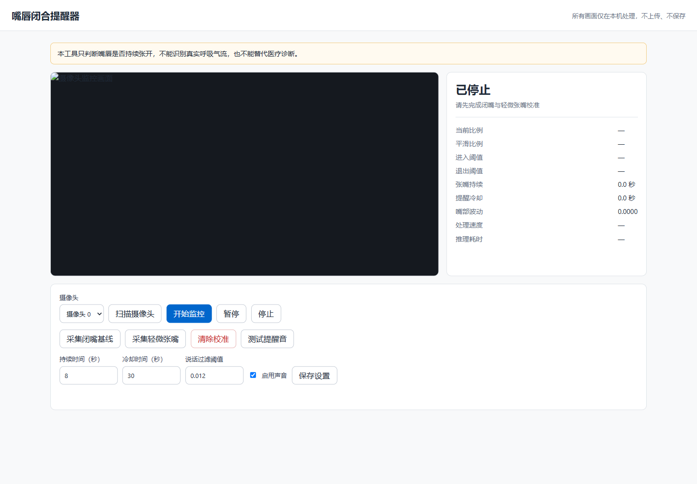
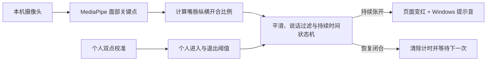

# Mouth Monitor

> 本地、可校准、隐私优先的 Windows 嘴唇闭合提醒工具。

[](https://github.com/AdS4TN/mouth-monitor/actions/workflows/build-windows.yml)


[](LICENSE)

Mouth Monitor 是一款面向电脑用户的**嘴唇闭合习惯提醒工具**。它使用普通摄像头实时观察嘴唇开合状态，当检测到嘴唇持续张开时，通过页面高亮和 Windows 提示音提醒用户调整状态。

整个体验很简单：打开应用、完成一次个人校准，然后像平时一样工作或学习。Mouth Monitor 会在后台持续分析摄像头画面，并在无意识张嘴持续发生时及时提醒。



## 为什么需要个人校准

不同人的唇形、摄像头角度、拍摄距离和自然闭合状态差异很大。Mouth Monitor 会根据每位用户采集的两组参考值建立个人识别阈值：

1. 自然闭嘴时的基线；
2. 轻微张嘴时的参考值。

程序根据这两个参考值生成个人进入阈值和退出阈值，并使用滞回区间、时间持续判断和嘴部活动过滤，减少摄像头抖动、短暂动作与正常说话造成的重复提醒。

## 它如何工作



- 摄像头画面在当前电脑内存中实时处理。
- 应用打开后即可使用，识别过程完全在本地完成。
- 本地配置文件仅记录应用设置和个人校准数值。
- 暂停或停止监控时，应用会立即释放摄像头。

## 当前能力

| 能力 | 说明 |
| --- | --- |
| 摄像头预览 | 实时显示画面和四个嘴唇关键点 |
| 个人双点校准 | 分别采集闭嘴与轻微张嘴参考值 |
| 持续状态判断 | 只有超过设定时间才触发提醒 |
| 说话动作过滤 | 根据最近一段时间的嘴唇比例波动暂停计时 |
| 提醒冷却 | 已提醒后进入冷却，避免连续播放声音 |
| 本地设置 | 保存摄像头、持续时间、冷却和声音设置 |
| 隐私优先 | 服务仅监听 `127.0.0.1`，画面在本机内存中处理 |
| Windows 打包 | 使用 PyInstaller 生成可双击运行的目录式程序 |

## 适用场景

- 工作或学习时经常无意识张嘴，希望得到轻量提醒；
- 想验证个人校准后的视觉识别是否对自己有效；
- 希望摄像头数据完全留在本机；
- 想研究 MediaPipe、本地视觉状态机或 Python 桌面工具架构。

## 快速开始

### 环境要求

- Windows 10 或 Windows 11；
- Python 3.11 或 3.12；
- 可用的内置或 USB 摄像头；
- 推荐使用 [uv](https://docs.astral.sh/uv/) 管理依赖。

MediaPipe 的 Windows 依赖体积较大，首次安装前请确保磁盘有足够空间。

### 从源码运行

```powershell
git clone https://github.com/AdS4TN/mouth-monitor.git
cd mouth-monitor
uv sync --group dev
uv run mouth-monitor
```

应用默认监听 `127.0.0.1:8765`，启动后自动打开浏览器。若不希望自动打开浏览器：

```powershell
$env:MOUTH_MONITOR_NO_BROWSER = "1"
uv run mouth-monitor
```

## 第一次使用

1. 点击“扫描摄像头”，选择可用设备；
2. 点击“开始监控”，确认画面中能识别人脸和嘴唇关键点；
3. 自然闭合嘴唇，点击“采集闭嘴基线”，稳定保持约 3 秒；
4. 轻微张嘴，点击“采集轻微张嘴”，稳定保持约 3 秒；
5. 恢复正常使用电脑，持续张嘴超过设置时间后会触发提醒。

校准结果与摄像头绑定。更换摄像头、拍摄距离或角度明显变化后，建议重新校准。

## 识别逻辑

Mouth Monitor 当前使用 MediaPipe Face Landmarker 返回的四个嘴唇关键点：

- 上唇中心：`13`；
- 下唇中心：`14`；
- 左嘴角：`78`；
- 右嘴角：`308`。

程序计算：

```text
嘴唇开合比例 = 上下唇距离 / 左右嘴角距离
```

左右嘴角距离作为归一化尺度，因此用户轻微前后移动时，比例通常比直接使用像素距离更稳定。完成双点校准后：

```text
进入阈值 = 闭嘴基线 + (张嘴参考 - 闭嘴基线) × 0.45
退出阈值 = 闭嘴基线 + (张嘴参考 - 闭嘴基线) × 0.25
```

进入和退出使用不同阈值，形成稳定的滞回区间。持续时间使用单调时钟计算，与摄像头帧率解耦。

## 隐私设计

- FastAPI 服务绑定本机回环地址 `127.0.0.1`；
- 摄像头帧用于实时推理和当前页面预览；
- `%LOCALAPPDATA%\MouthMonitor\config.json` 保存应用设置与校准数值；
- 停止或暂停监控时自动释放摄像头；
- 整套识别链路在当前电脑上完成。

## Windows 打包

```powershell
.\scripts\build.ps1
```

如果系统盘空间不足，可将构建环境和产物放到其他磁盘：

```powershell
$env:UV_CACHE_DIR = "D:\mouth-monitor-build\cache"
$env:UV_PROJECT_ENVIRONMENT = "D:\mouth-monitor-build\venv"
$env:TEMP = "D:\mouth-monitor-build\temp"
$env:TMP = "D:\mouth-monitor-build\temp"
.\scripts\build.ps1 -OutputRoot D:\mouth-monitor-build\release
```

构建脚本会先执行测试，然后生成：

```text
dist\MouthMonitor\MouthMonitor.exe
dist\MouthMonitor-windows-x64.zip
```

项目使用 PyInstaller `onedir` 模式，避免每次启动重复解压模型和动态库。

## 项目结构

```text
src/mouth_monitor/
├── app.py            FastAPI、WebSocket 与 MJPEG 接口
├── engine.py         摄像头线程、校准、状态机和提醒编排
├── camera.py         摄像头扫描、打开与释放
├── vision.py         MediaPipe 推理和嘴唇比例计算
├── state_machine.py  持续张嘴状态机
├── calibration.py    双点校准与阈值生成
├── storage.py        本地设置持久化
├── reminder.py       Windows 系统提示音与冷却
├── assets/           MediaPipe 模型
└── web/              浏览器控制台
```

核心模块刻意分离：视觉层只负责产生嘴唇比例，状态机不依赖摄像头和 MediaPipe，因此可以用普通数值输入完成自动测试。

## 开发与测试

```powershell
uv sync --group dev
uv run pytest -q
```

当前测试覆盖：

- 双点校准与失败条件；
- 闭嘴、嘴部活动、持续张嘴状态转换；
- 摄像头切换后校准失效；
- 设置保存、读取和损坏恢复；
- FastAPI 页面、状态、启动和设置接口。

## 路线图

- [ ] 提供经过签名的 Windows Release；
- [ ] 增加系统托盘与更自然的后台控制；
- [ ] 改进摄像头设备名称和断线重连；
- [ ] 增加头部角度和画面质量门控；
- [ ] 收集真实使用反馈，继续降低说话与短暂动作误报；
- [ ] 在识别方案稳定后评估 Android 端适配。

## 贡献

Issue 和 Pull Request 都欢迎。提交前请阅读 [CONTRIBUTING.md](CONTRIBUTING.md)。尤其欢迎以下反馈：

- 不同摄像头、光线和脸型下的识别表现；
- 可复现的误报与漏报场景；
- 校准和状态机参数改进；
- Windows 打包、摄像头兼容和隐私设计建议。

## License

[MIT](LICENSE) © 2026 Mouth Monitor Contributors
